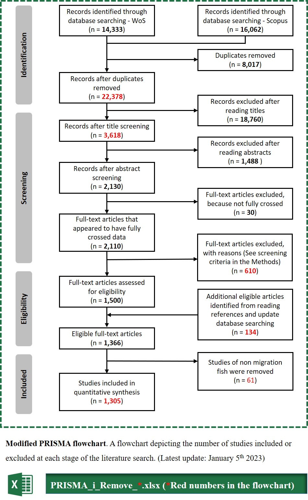

# Fish and Fisheries: *FaF-22-Jul-OA-197*

### Literature screening

Literature screening was performed mainly through Microsoft Excel with Visual Basic screening buttons (e.g., Include, Exclude, and Maybe button; Lajeunesse, 2021). 

See [**Microsoft_Excel_VB_screening_Example.xlsm**](Microsoft_Excel_VB_screening_button/Example.xlsm)

Based on their titles, abstracts, and keywords, deduplicated documents were filtered out that did not relate to non-migratory fish species, elements, or isotopes. Based on these criteria, the full texts of articles were reviewed to remove those that did not meet the requirements. The following are examples of areas where research is limited: 

- laboratory experiments and rearing, 
- ambiguity in scientific nomenclature (e.g., Oncorhynchus spp.), 
- investigations into trophic ecology and bioaccumulation in laboratory, 
- studies involving non-migratory fish. 

See [**PRISMA_3_Remove_610.xlsx**](result/PRISMA_3_Remove_610.xlsx)

Screening was performed in real-time by a pair of independent reviewers. If agreements were achieved, the relevant documents were removed; otherwise, they were kept for further review. Additional case studies were included after screening the bibliographies of relevant reviews. The Preferred Reporting Items for Systematic Reviews and Meta-Analyses (PRISMA, Moher *et al*., 2009) modified flowchart was adhered to throughout the process of including or excluding studies at each level. Our final cut was 1,305 studies, all of which met our inclusion criteria and were used to populate our [**MFishBT**](https://fish-ecology.shinyapps.io/mfishbt) database (Ding *et al*., 2023).

### Citation

[1] Ding, L. Y., Ding, C. Z., Tao, J., Avigliano, E., Shipley, O. N., Tang, B. L., Chen, J. N., Liu, X. C., Sun, J. R., & He, D. M. (2023). Data and Code for: MFishBT: A global database of biogeochemical tags in migratory fish. *Zenodo*. **https://doi.org/10.5281/zenodo.8418722**

[2] Lajeunesse, M.J. (2021). Screening studies with Microsoft Excel for systematic reviews and meta-analysis. *Figshare*. **https://dx.doi.org/10.6084/m9.figshare.14179655**

[3] Moher, D., Liberati, A., Tetzlaff, J., Altman, D. G., & PRISMA Group\*. 2009. Preferred reporting items for systematic reviews and meta-analyses: the PRISMA statement. *Annals of Internal Medicine*, *151*(4), 264–269. **https://dx.doi.org/10.7326/0003-4819-151-4-200908180-00135**

### Contribution

The online MFishBT database (**https://fish-ecology.shinyapps.io/mfishbt**) is dynamic, and new papers will continue to be added on a rolling basis as they are published. A web upload form on the R-shiny site allows user-submitted database entries that will be reviewed by the MFishBT team and added as appropriate (**https://fish-ecology.shinyapps.io/mfishbt/#section-submit-data**).